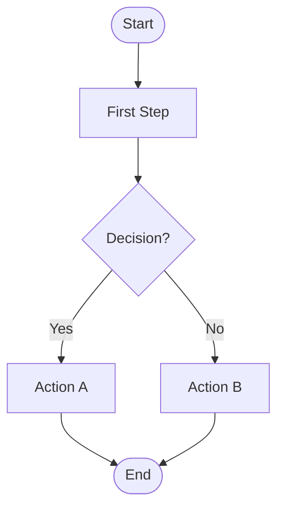
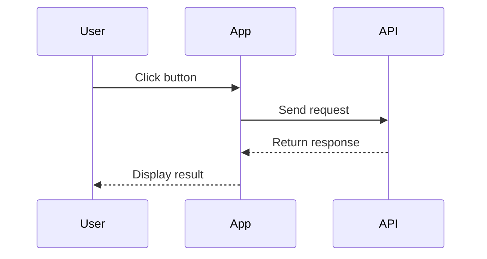

# JavaScript Client Panel Diagrams

This directory contains visual diagrams that illustrate key workflows and processes in the JavaScript Client panel.

## Available Diagrams

### 1. Panel Switching Flow
**File:** `panel-switching-flow.md`

**Purpose:** Shows how the dashboard switches between Node.js, Python, and JavaScript Client panels based on the `dashboard-service-panel-1` feature flag.

**Key Concepts:**
- Feature flag-driven UI control
- Real-time panel switching without page reload
- Dynamic service selection
- State management across panels

**When to Use:**
- Explaining how the panel selector works
- Demonstrating feature flag-driven UI changes
- Understanding the dashboard architecture
- Teaching real-time flag updates

**Diagram Type:** Flowchart

---

### 2. SDK Initialization Sequence
**File:** `sdk-initialization-sequence.md`

**Purpose:** Illustrates the complete initialization sequence from dashboard load to fully functional JavaScript Client panel.

**Key Concepts:**
- SDK initialization process
- Relay Proxy connection establishment
- Streaming connection setup
- Panel UI initialization
- Real-time update loop

**When to Use:**
- Understanding SDK startup process
- Debugging initialization issues
- Explaining Proxy Mode architecture
- Teaching SDK lifecycle

**Diagram Type:** Sequence Diagram

---

### 3. Context Change Flow
**File:** `context-change-flow.md`

**Purpose:** Shows the complete flow when a user changes context from anonymous to custom or vice versa.

**Key Concepts:**
- Context editor modal workflow
- Form validation
- SDK identify() method
- Flag re-evaluation
- Panel update process

**When to Use:**
- Explaining context management
- Understanding flag targeting
- Debugging context change issues
- Teaching SDK context API

**Diagram Type:** Flowchart

---

## Viewing the Diagrams

### In Markdown Viewers
Most modern Markdown viewers support Mermaid diagrams natively:
- **GitHub:** Renders Mermaid automatically
- **GitLab:** Renders Mermaid automatically
- **VS Code:** Install "Markdown Preview Mermaid Support" extension
- **IntelliJ IDEA:** Built-in Mermaid support

### In Documentation Sites
If using a documentation generator:
- **MkDocs:** Use `mkdocs-mermaid2-plugin`
- **Docusaurus:** Built-in Mermaid support
- **Jekyll:** Use `jekyll-mermaid` plugin
- **Hugo:** Use `hugo-mermaid` shortcode

### Online Mermaid Editor
For editing or viewing diagrams:
1. Visit [Mermaid Live Editor](https://mermaid.live/)
2. Copy the Mermaid code from any diagram file
3. Paste into the editor
4. View, edit, and export as PNG/SVG

### Converting to Images
To convert Mermaid diagrams to static images:

**Using Mermaid CLI:**
```bash
# Install mermaid-cli
npm install -g @mermaid-js/mermaid-cli

# Convert to PNG
mmdc -i panel-switching-flow.md -o panel-switching-flow.png

# Convert to SVG
mmdc -i panel-switching-flow.md -o panel-switching-flow.svg
```

**Using Online Tools:**
- [Mermaid Live Editor](https://mermaid.live/) - Export as PNG/SVG
- [Kroki](https://kroki.io/) - API for diagram generation

---

## Diagram Conventions

### Colors
- **Green (#4CAF50):** Success states, completed actions
- **Blue (#2196F3):** SDK operations, data flow
- **Orange (#FF9800):** Processing, evaluation
- **Purple (#9C27B0):** Decision points
- **Red (#F44336):** Error states, failures

### Node Shapes
- **Rounded rectangles:** Process steps
- **Diamonds:** Decision points
- **Circles:** Start/end points
- **Rectangles:** Data or state

### Flow Direction
- **Top to bottom:** Sequential processes
- **Left to right:** Parallel processes or timelines
- **Loops:** Continuous or repeated operations

---

## Updating Diagrams

When updating diagrams:

1. **Verify Accuracy:** Ensure diagram matches current implementation
2. **Test Rendering:** Verify Mermaid syntax is valid
3. **Update Documentation:** Update related documentation references
4. **Version Control:** Commit diagram changes with descriptive messages
5. **Review:** Have technical reviewer verify accuracy

### Mermaid Syntax Resources
- [Mermaid Documentation](https://mermaid.js.org/)
- [Flowchart Syntax](https://mermaid.js.org/syntax/flowchart.html)
- [Sequence Diagram Syntax](https://mermaid.js.org/syntax/sequenceDiagram.html)
- [Mermaid Cheat Sheet](https://jojozhuang.github.io/tutorial/mermaid-cheat-sheet/)

---

## Creating New Diagrams

When creating new diagrams:

### 1. Choose Diagram Type
- **Flowchart:** Process flows, decision trees, workflows
- **Sequence Diagram:** Interactions between components over time
- **State Diagram:** State transitions and lifecycle
- **Class Diagram:** Object relationships and structure
- **Entity Relationship:** Data models and relationships

### 2. Plan the Diagram
- Identify key components and actors
- Define the flow or sequence
- Determine decision points
- Plan for error cases

### 3. Write Mermaid Code
- Use clear, descriptive labels
- Follow naming conventions
- Add notes for complex steps
- Use consistent styling

### 4. Document the Diagram
- Add description section
- Explain key concepts
- Provide code examples
- Link to related documentation

### 5. Test and Review
- Verify rendering in multiple viewers
- Check for clarity and accuracy
- Get feedback from users
- Iterate based on feedback

---

## Example: Creating a Simple Flowchart



**Code:**
```
flowchart TD
    Start([Start]) --> Step1[First Step]
    Step1 --> Decision{Decision?}
    Decision -->|Yes| Step2[Action A]
    Decision -->|No| Step3[Action B]
    Step2 --> End([End])
    Step3 --> End
```

---

## Example: Creating a Simple Sequence Diagram



**Code:**
```
sequenceDiagram
    participant User
    participant App
    participant API
    
    User->>App: Click button
    App->>API: Send request
    API-->>App: Return response
    App-->>User: Display result
```

---

## Troubleshooting

### Diagram Not Rendering
- **Check Syntax:** Verify Mermaid syntax is valid
- **Check Viewer:** Ensure viewer supports Mermaid
- **Check Version:** Some features require newer Mermaid versions
- **Check Indentation:** Mermaid is sensitive to indentation

### Diagram Too Complex
- **Split Diagram:** Break into multiple smaller diagrams
- **Simplify Flow:** Remove unnecessary details
- **Use Subgraphs:** Group related nodes
- **Add Notes:** Explain complex parts in text

### Diagram Not Clear
- **Add Labels:** Use descriptive node labels
- **Add Colors:** Use colors to highlight important paths
- **Add Notes:** Add explanatory notes to diagram
- **Get Feedback:** Ask users if diagram is clear

---

## Related Documentation

- [JavaScript Client Panel Documentation](../README.md)
- [Code Examples](../examples/README.md)
- [Screenshot Instructions](../images/SCREENSHOT_INSTRUCTIONS.md)
- [Mermaid Documentation](https://mermaid.js.org/)

---

## Contributing

When contributing diagrams:

1. Follow existing diagram conventions
2. Use clear, descriptive labels
3. Test rendering in multiple viewers
4. Document the diagram purpose and usage
5. Link to related documentation
6. Submit for review before merging

---

## License

These diagrams are part of the LaunchDarkly Relay Proxy Enterprise Demo documentation and follow the same license as the project.
