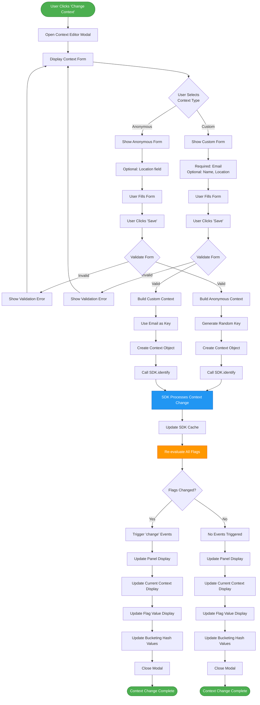

# Context Change Flow Diagram

This diagram illustrates the flow when a user changes the context (from anonymous to custom or vice versa) in the JavaScript Client panel.

## Mermaid Diagram



## Flow Description

### Phase 1: Modal Opening (Steps 1-3)
1. User clicks "Change Context" button in the panel
2. Dashboard opens context editor modal
3. Modal displays form with context type selector

### Phase 2: Form Selection (Steps 4-7)
User chooses between two context types:

**Anonymous Context:**
- Auto-generated unique key
- Optional location field
- `anonymous: true` flag set

**Custom Context:**
- Email field (required, used as key)
- Name field (optional)
- Location field (optional)
- `anonymous: false` flag set

### Phase 3: Form Validation (Steps 8-11)
1. User fills in form fields
2. User clicks "Save" button
3. Dashboard validates form data:
   - Custom context: Email is required
   - Anonymous context: No required fields
4. If invalid, show error and return to form
5. If valid, proceed to context creation

### Phase 4: Context Creation (Steps 12-15)
**For Anonymous Context:**
```javascript
const context = {
  kind: 'user',
  key: `javascript-anon-${randomId}`,
  anonymous: true,
  location: formData.location || undefined
};
```

**For Custom Context:**
```javascript
const context = {
  kind: 'user',
  key: formData.email,
  anonymous: false,
  email: formData.email,
  name: formData.name || undefined,
  location: formData.location || undefined
};
```

### Phase 5: SDK Identify Call (Steps 16-18)
1. Dashboard calls `SDK.identify(context)`
2. SDK processes the context change:
   - Updates internal context reference
   - Clears previous context data
   - Stores new context attributes
3. SDK updates its cache with new context

### Phase 6: Flag Re-evaluation (Steps 19-21)
1. SDK re-evaluates all flags with new context
2. Targeting rules are applied based on new context attributes
3. Flag values may change based on:
   - Email/key matching in targeting rules
   - Location-based targeting
   - Percentage rollouts (different bucket value)

### Phase 7: Event Triggering (Steps 22-24)
**If flag values changed:**
- SDK emits `change` events for each changed flag
- Dashboard listeners receive events
- Panel updates automatically

**If no flag values changed:**
- No events emitted
- Panel still updates to show new context

### Phase 8: Panel Update (Steps 25-30)
1. Update "Current Context" section:
   - Display new context type
   - Display new context key
   - Display new context attributes
2. Update flag value display (if changed)
3. Recalculate and update bucketing hash values
4. Close the context editor modal
5. Context change complete

## Timing Breakdown

| Phase | Operation | Typical Duration |
|-------|-----------|------------------|
| 1-2 | Modal open and render | 10-50ms |
| 3-7 | User interaction | Variable (user-dependent) |
| 8-11 | Form validation | <10ms |
| 12-15 | Context creation | <5ms |
| 16-18 | SDK identify call | 50-150ms |
| 19-21 | Flag re-evaluation | 10-50ms |
| 22-24 | Event triggering | <10ms |
| 25-30 | Panel UI update | 50-100ms |
| **Total** | **Complete flow** | **120-375ms** (excluding user interaction) |

## Code Example

```javascript
// Context change handler
async function changeContext(formData) {
  try {
    // Build context object based on type
    let context;
    
    if (formData.contextType === 'anonymous') {
      const randomId = Math.random().toString(36).substring(7);
      context = {
        kind: 'user',
        key: `javascript-anon-${randomId}`,
        anonymous: true
      };
      
      if (formData.location) {
        context.location = formData.location;
      }
    } else {
      // Custom context
      if (!formData.email) {
        throw new Error('Email is required for custom context');
      }
      
      context = {
        kind: 'user',
        key: formData.email,
        anonymous: false,
        email: formData.email
      };
      
      if (formData.name) context.name = formData.name;
      if (formData.location) context.location = formData.location;
    }
    
    // Call SDK identify
    await window.jsClientSDK.identify(context);
    
    console.log('Context changed successfully:', context);
    
    // Update panel display
    updateJavaScriptClientPanel();
    
    // Close modal
    closeContextModal();
  } catch (error) {
    console.error('Context change failed:', error);
    showError(error.message);
  }
}

// Set up change listener
window.jsClientSDK.on('change', (changes) => {
  console.log('Flags changed after context change:', changes);
  updateJavaScriptClientPanel();
});
```

## Impact on Flag Evaluation

### Targeting Rules
When context changes, targeting rules are re-evaluated:

**Example Rule:** "Show variation A to users in San Francisco"
- Anonymous context with `location: "San Francisco"` → Matches rule
- Custom context without location → Doesn't match rule
- Custom context with `location: "New York"` → Doesn't match rule

### Percentage Rollouts
Different context keys produce different bucket values:

**Example:**
- Context key `javascript-anon-abc123` → Bucket value 0.234 → Variation 0
- Context key `user@example.com` → Bucket value 0.876 → Variation 1

Same context key always produces same bucket value for a given flag.

### Individual Targeting
Custom contexts can be individually targeted:

**Example:** Target `user@example.com` to receive variation B
- Anonymous context → Not targeted (receives default)
- Custom context with different email → Not targeted
- Custom context with `user@example.com` → Targeted (receives variation B)

## User Experience

### Smooth Transition
- Modal provides clear form with validation
- Loading indicator during SDK call
- Automatic panel update on success
- Error messages on failure

### Immediate Feedback
- Context display updates instantly
- Flag values update if changed
- Hash values recalculate automatically
- No page refresh required

### State Preservation
- SDK remains connected throughout
- Streaming connection maintained
- No re-initialization needed
- Panel state preserved

## Error Handling

### Validation Errors
- Missing required fields (email for custom context)
- Invalid email format
- Form shows inline error messages

### SDK Errors
- Network failure during identify call
- Timeout waiting for SDK response
- Modal shows error message, allows retry

### Recovery
- User can correct errors and retry
- Cancel button closes modal without changes
- Previous context remains active on error

## Related Documentation

- [Context Management](../README.md#context-management) - Context types and attributes
- [Panel Features](../README.md#panel-features) - Current Context display
- [Using the Panel](../README.md#using-the-panel) - Step-by-step instructions
- [Technical Details](../README.md#technical-details) - SDK identify() method
