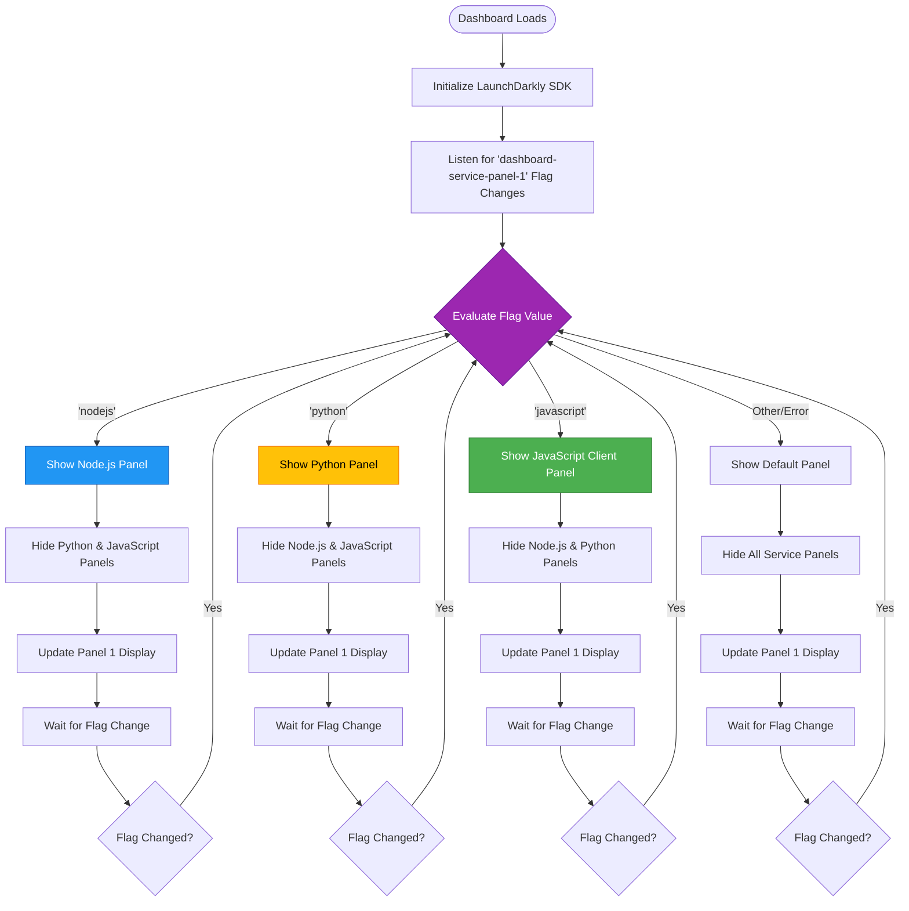

# Panel Switching Flow Diagram

This diagram illustrates how the dashboard switches between different service panels based on the `dashboard-service-panel-1` feature flag value.

## Mermaid Diagram



## Flow Description

### 1. Dashboard Initialization
When the dashboard loads, it initializes the main LaunchDarkly SDK and sets up a listener for the `dashboard-service-panel-1` feature flag.

### 2. Flag Evaluation
The SDK evaluates the flag and returns one of three values:
- `'nodejs'` - Display the Node.js service panel
- `'python'` - Display the Python service panel
- `'javascript'` - Display the JavaScript Client panel

### 3. Panel Display Logic
Based on the flag value:
- The corresponding panel is made visible
- All other service panels are hidden
- Panel 1 container updates to show only the selected service

### 4. Real-Time Updates
The dashboard maintains a persistent listener on the flag:
- When the flag value changes in LaunchDarkly, the SDK receives the update via streaming
- The change event triggers immediately (no page refresh needed)
- The panel switching logic re-evaluates and updates the display
- The transition is seamless and instant

### 5. Dynamic Behavior
- Only one service panel is visible at a time
- Panel switching happens in real-time without page reload
- Each panel maintains its own state and SDK instance
- Terminal panels automatically switch to show logs for the active service

## Implementation Details

### Flag Listener Setup
```javascript
// Listen for changes to the panel selector flag
ldClient.on('change:dashboard-service-panel-1', (newValue, oldValue) => {
  console.log(`Panel flag changed from '${oldValue}' to '${newValue}'`);
  updatePanelDisplay(newValue);
});
```

### Panel Display Function
```javascript
function updatePanelDisplay(flagValue) {
  // Hide all panels
  document.getElementById('nodejs-panel').style.display = 'none';
  document.getElementById('python-panel').style.display = 'none';
  document.getElementById('javascript-panel').style.display = 'none';
  
  // Show selected panel
  switch(flagValue) {
    case 'nodejs':
      document.getElementById('nodejs-panel').style.display = 'block';
      break;
    case 'python':
      document.getElementById('python-panel').style.display = 'block';
      break;
    case 'javascript':
      document.getElementById('javascript-panel').style.display = 'block';
      break;
    default:
      console.warn('Unknown panel value:', flagValue);
  }
}
```

## Key Characteristics

### Instant Switching
- No page reload required
- Streaming connection provides real-time updates
- Typical latency: <100ms from flag change to UI update

### State Preservation
- Each panel maintains its own state
- Switching away and back preserves panel data
- SDK instances remain initialized

### Error Handling
- Invalid flag values show default state
- SDK initialization failures are logged
- Fallback behavior ensures dashboard remains functional

## Use Cases

### Demonstration Scenarios
1. **Feature Comparison**: Switch between panels to compare SDK behaviors
2. **Client vs Server**: Show differences between client-side and server-side SDKs
3. **Language Comparison**: Demonstrate SDK consistency across Node.js, Python, and JavaScript

### Testing Scenarios
1. **Real-Time Updates**: Verify streaming flag updates work correctly
2. **State Management**: Confirm panel state persists across switches
3. **Performance**: Measure panel switching latency

### Educational Scenarios
1. **SDK Modes**: Explain Proxy Mode vs Daemon Mode
2. **Architecture**: Show how different SDKs integrate with Relay Proxy
3. **Flag Control**: Demonstrate feature flag-driven UI changes

## Related Documentation

- [Enabling the Panel](../README.md#enabling-the-panel) - How to set the flag value
- [Panel Features](../README.md#panel-features) - What each panel displays
- [Technical Details](../README.md#technical-details) - SDK configuration details
