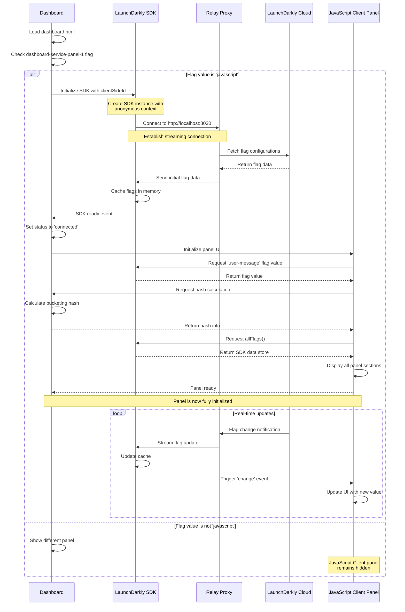

# SDK Initialization Sequence Diagram

This diagram illustrates the initialization sequence for the JavaScript Client SDK when the panel loads.

## Mermaid Diagram



## Sequence Description

### Phase 1: Dashboard Load (Steps 1-2)
1. Browser loads `dashboard.html`
2. Dashboard evaluates `dashboard-service-panel-1` flag
3. If flag value is `'javascript'`, proceed with initialization

### Phase 2: SDK Initialization (Steps 3-7)
1. Dashboard calls `LDClient.initialize()` with:
   - Client-side ID
   - Anonymous context (auto-generated key)
   - Proxy Mode configuration (localhost:8030)

2. SDK establishes streaming connection to Relay Proxy
3. Relay Proxy fetches current flag configurations from LaunchDarkly
4. Relay Proxy sends initial flag data to SDK
5. SDK caches flags in browser memory
6. SDK emits 'ready' event to dashboard

**Timing:** Typically 200-500ms depending on network latency

### Phase 3: Panel Initialization (Steps 8-15)
1. Dashboard sets status indicator to 'connected' (green dot)
2. Dashboard initializes JavaScript Client panel UI
3. Panel requests current value of `user-message` flag
4. Panel requests hash calculation for bucketing display
5. Panel requests all flags from SDK cache (`allFlags()`)
6. Panel displays all sections with data
7. Panel signals ready state to dashboard

**Timing:** Typically 50-100ms (local operations)

### Phase 4: Real-Time Updates (Continuous Loop)
1. When a flag changes in LaunchDarkly:
   - LaunchDarkly pushes update to Relay Proxy
   - Relay Proxy streams update to SDK
   - SDK updates its cache
   - SDK emits 'change' event
   - Panel updates UI automatically

**Timing:** Typically <100ms from flag change to UI update

## Key Characteristics

### Asynchronous Initialization
- SDK initialization is non-blocking
- Dashboard uses `waitForInitialization()` with 5-second timeout
- Panel UI updates progressively as data becomes available

### Streaming Connection
- Persistent Server-Sent Events (SSE) connection
- Enables real-time flag updates without polling
- Automatic reconnection on connection loss

### Proxy Mode Architecture
- SDK connects to Relay Proxy, not LaunchDarkly directly
- Relay Proxy handles communication with LaunchDarkly Cloud
- Reduces client-side network complexity
- Enables centralized configuration and caching

### Error Handling
- Initialization timeout (5 seconds) prevents indefinite waiting
- Connection failures trigger status indicator (red dot)
- Fallback values used if SDK unavailable
- Automatic retry on connection loss

## Initialization States

### State 1: Disconnected (Red Dot)
- SDK not initialized or connection lost
- Panel shows "Loading..." or cached values
- No real-time updates

### State 2: Connecting (Orange Dot)
- SDK initialization in progress
- Establishing connection to Relay Proxy
- Fetching initial flag data

### State 3: Connected (Green Dot)
- SDK fully initialized and ready
- Streaming connection active
- Real-time updates enabled
- All panel features functional

## Code Example

```javascript
// Dashboard initialization code
async function initializeJavaScriptClientPanel() {
  try {
    // Set status to connecting
    updatePillStatus('javascript', 'connecting');
    
    // Initialize SDK
    const randomId = Math.random().toString(36).substring(7);
    window.jsClientSDK = window.LDClient.initialize(clientSideId, {
      kind: 'user',
      key: `javascript-anon-${randomId}`,
      anonymous: true
    }, {
      baseUrl: 'http://localhost:8030',
      streamUrl: 'http://localhost:8030',
      eventsUrl: 'http://localhost:8030',
      streaming: true,
      sendEvents: false,
      diagnosticOptOut: true,
      evaluationReasons: true
    });
    
    // Wait for initialization (5 second timeout)
    await window.jsClientSDK.waitForInitialization(5);
    
    // Set status to connected
    updatePillStatus('javascript', 'connected');
    
    // Initialize panel UI
    updateJavaScriptClientPanel();
    
    // Set up change listeners
    window.jsClientSDK.on('change', () => {
      updateJavaScriptClientPanel();
    });
    
    console.log('JavaScript Client SDK initialized successfully');
  } catch (error) {
    console.error('SDK initialization failed:', error);
    updatePillStatus('javascript', 'disconnected');
  }
}
```

## Timing Breakdown

| Phase | Operation | Typical Duration |
|-------|-----------|------------------|
| 1 | Dashboard load | 100-300ms |
| 2 | Flag evaluation | <10ms |
| 3 | SDK initialization | 200-500ms |
| 4 | Relay Proxy connection | 50-150ms |
| 5 | Initial flag fetch | 100-300ms |
| 6 | Panel UI render | 50-100ms |
| **Total** | **Complete initialization** | **500-1350ms** |

## Comparison with Other Panels

| Aspect | JavaScript Client | Node.js | Python |
|--------|------------------|---------|--------|
| **Initialization** | Automatic on load | Manual start button | Manual start button |
| **Connection** | Direct to Relay Proxy | Via Relay Proxy | Via Redis (daemon mode) |
| **Updates** | Streaming (instant) | Streaming (instant) | Polling (5-30s delay) |
| **Container** | None (browser) | Docker container | Docker container |
| **Startup Time** | 500-1350ms | 2-5 seconds | 2-5 seconds |

## Troubleshooting

### Issue: Orange Dot Persists
**Cause:** SDK cannot connect to Relay Proxy  
**Solution:** Verify Relay Proxy is running on localhost:8030

### Issue: Red Dot After Initialization
**Cause:** Initialization timeout or connection failure  
**Solution:** Check browser console for errors, verify network connectivity

### Issue: Panel Shows "Loading..."
**Cause:** SDK not initialized or flag evaluation failed  
**Solution:** Verify SDK is connected (green dot), check flag exists in LaunchDarkly

### Issue: No Real-Time Updates
**Cause:** Streaming connection not established  
**Solution:** Verify `streaming: true` in config, check Relay Proxy logs

## Related Documentation

- [Panel Features](../README.md#panel-features) - Status indicator meanings
- [Technical Details](../README.md#technical-details) - SDK configuration
- [Troubleshooting](../README.md#troubleshooting) - Common issues and solutions
